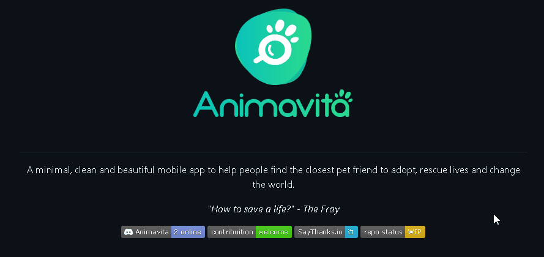

# Projeto com README
um projeto de teste com um arquivo REAME🚀
[]
## Tecnologias utilizadas
- HTML
- CSS
- JS
## Com utilizar 
1 - Clone para o projeto
```
git clone <url>
```
2 - Acesse a pasta do projeto
```
cd repositorio-com-readme
```

